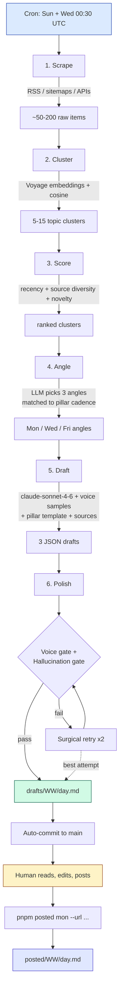
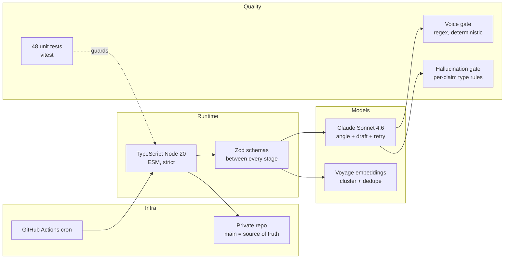

# linkedin-engine — one-pager

> **An autonomous content engine that writes 3 source-grounded LinkedIn posts per week, designed to land an AI PM role at a frontier model company.**

---

## Why

Building public credibility for an AI PM role requires consistent, high-signal LinkedIn presence. Manual writing fails for three reasons:

| Failure mode | Cost |
|---|---|
| Skipping weeks when busy | Algorithm punishes inconsistency, audience forgets |
| AI-slop shortcuts | Burns credibility with the exact frontier-lab audience you want to reach |
| Hallucinated facts | One bad stat undoes months of trust |

The engine removes those failure modes by automating the boring parts (sourcing, drafting, gating) while keeping the human in the loop for taste (editing + posting).

---

## What

A TypeScript pipeline that runs every Sunday and Wednesday at 06:00 IST on GitHub Actions. Every run produces 3 draft posts (Mon / Wed / Fri) that are:

- **Grounded** — every named person, quoted phrase, numeric stat, and product capability is verified against a source URL
- **In voice** — deterministic gate enforces 7+ rules (no em-dashes, no AI clichés, hook length, paragraph density, "I" frequency)
- **On cadence** — pillar mix is fixed per day (Mon hot take, Wed framework/lesson/myth, Fri story/observation/list)
- **Cheap** — ~$0.04 per week ($2/year)

Output: `drafts/YYYY-WW/{mon,wed,fri}.md`. Human reads, edits, posts, marks done.

---

## The flow

---

## What problem each stage solves

| Stage | Problem | Mechanism |
|---|---|---|
| **Scrape** | Need fresh, trustworthy primary sources, not AI-generated noise | Curated allowlist in `config/sources.yaml` (frontier labs, top researchers' RSS) |
| **Cluster** | Same story breaks across 5 outlets — don't draft 5 versions of it | Voyage embeddings + cosine similarity grouping |
| **Score** | Most clusters aren't worth posting about | Composite: recency × source diversity × novelty vs. last 4 weeks |
| **Angle** | Posting "what happened" is commodity; posting "what it means" is differentiated | LLM picks 3 angles, one per day, constrained to that day's allowed pillars |
| **Draft** | Generic AI prose dies on LinkedIn | Voice samples from the user's own past posts + pillar template + grounded source bodies |
| **Polish** | Even "good" LLM output sneaks in clichés, em-dashes, fabricated stats | Deterministic regex gate + per-claim source verification; surgical retries; publishes the best of 3 attempts |

---

## How it's done — stack

---

## Hard constraints (non-negotiable)

- ❌ NO hallucinated facts — every stat / quote / name / capability must trace to a source URL
- ❌ NO em-dashes, en-dashes, or LinkedIn AI clichés ("game-changer", "deep dive", "leverage", etc.)
- ❌ NO scraping internal artifacts (PRDs, Slack, sprint notes)
- ❌ NO auto-posting — human is the final filter
- ✅ Total spend ceiling: **<$1.50 / week** (currently $0.04)

---

## Status

Production. First end-to-end run: 2026-04-19. Cron armed. Drafts published to [`drafts/`](drafts/) on every run.

**Next milestone:** ship 12 weeks (Apr → Jul 2026) of consistent, high-quality posts. Use as portfolio for AI PM applications.
