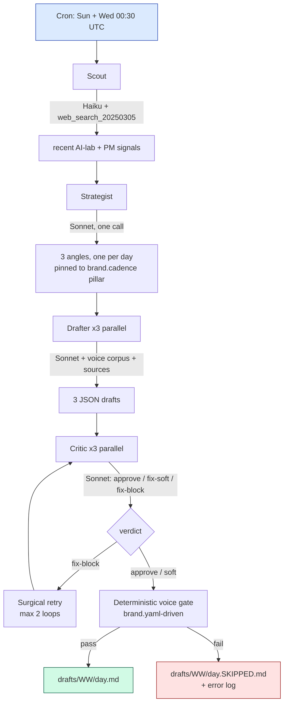

# linkedin-engine — one-pager

> **An autonomous content engine that writes 3 source-grounded LinkedIn posts per week, designed to land an AI PM role at a frontier model company.**

---

## Why

Building public credibility for an AI PM role requires consistent, high-signal LinkedIn presence. Manual writing fails for three reasons:

| Failure mode | Cost |
|---|---|
| Skipping weeks when busy | Algorithm punishes inconsistency, audience forgets |
| AI-slop shortcuts | Burns credibility with the exact frontier-lab audience you want to reach |
| Hallucinated facts | One bad stat undoes months of trust |

The engine removes those failure modes by automating the boring parts (sourcing, drafting, gating) while keeping the human in the loop for taste (editing + posting).

---

## What

A TypeScript pipeline that runs every Sunday and Wednesday at 06:00 IST on GitHub Actions. Every run produces up to 3 draft posts (Mon / Wed / Fri) that are:

- **Grounded** — every named person, quoted phrase, numeric stat, and product capability is tied to a source URL via a structured Claim
- **In voice** — deterministic voice gate, driven by `brand.yaml`, enforces banned phrases, rhythm bands, and dash discipline. Any drafter slip that gets past the critic is caught here.
- **On cadence** — pillar mix is fixed per day via `brand.cadence.{mon,wed,fri}.pillar`
- **Cheap** — ~$0.20 / run, well under the $0.50 budget

Output: `drafts/YYYY-WW/{mon,wed,fri}.md`. Human reads, edits, posts.

---

## The flow



---

## What each stage owns

| Stage | Problem | Mechanism |
|---|---|---|
| **Scout** | Need fresh, trustworthy primary signals, not AI-generated noise | Haiku with `web_search_20250305`; RSS fallback via `config/sources.yaml` |
| **Strategist** | Posting "what happened" is commodity; posting "what it means" is differentiated | Sonnet picks one angle per day, constrained to `brand.cadence[day].pillar` |
| **Drafter** | Generic AI prose dies on LinkedIn | Voice corpus samples + pillar template + scout sources, parallel fan-out |
| **Critic** | Catch weak hooks, fabricated authority, saturated buzzwords before publishing | Pillar-aware rubric with `approve / fix-soft / fix-block` + specific_fixes |
| **Voice gate** | Deterministic final word on banned phrases, rhythm, dashes | Pre-gate scrubber swaps known banned phrases; gate reads bands from `brand.yaml` |

---

## Single source of truth: `brand.yaml`

Every tunable lives in one file. Change the banned phrase list, rhythm bands, pillar cadence, or agent model — no code edit required, the next run picks it up.

```yaml
voice:
  must_not_have:
    em_dashes: true
    banned_phrases: [ "leverage", "game-changer", ... ]
  rhythm:
    hook_max_words: 12
    target_words: [180, 340]
cadence:
  mon: { pillar: shipped, requires: [shipping_anecdote, ...] }
agents:
  drafter: { model: claude-sonnet-4-6, max_tokens: 1500, parallel: true }
budgets:
  cost_usd_per_run: 0.50
```

---

## Stack

- **Runtime**: TypeScript Node 20 ESM (strict, isolatedModules)
- **Models**: Claude Haiku 4.5 (scout), Claude Sonnet 4.6 (strategist / drafter / critic)
- **Validation**: Zod schemas at every stage boundary
- **Testing**: vitest, 120 unit tests, green pre-merge
- **Infra**: GitHub Actions cron + `workflow_dispatch`, commits to `main`

---

## Hard constraints (non-negotiable)

- NO hallucinated facts — every non-opinion claim carries a source_url verbatim from scout sources
- NO em-dashes, en-dashes, or LinkedIn AI clichés — deterministic gate + pre-gate sanitizer
- NO auto-posting — human is the final filter
- Total spend ceiling: **$0.50 / run** asserted in CI

---

## Status

Production. Agentic pipeline lives at `src/agentic-pipeline.ts`. Legacy 6-stage pipeline retired in Task 11. Cron armed Sun + Wed 00:30 UTC. Drafts land in [`drafts/`](drafts/) on every run.

**Next milestone:** ship 12 weeks (Apr → Jul 2026) of consistent, high-quality posts. Portfolio for AI PM applications.
