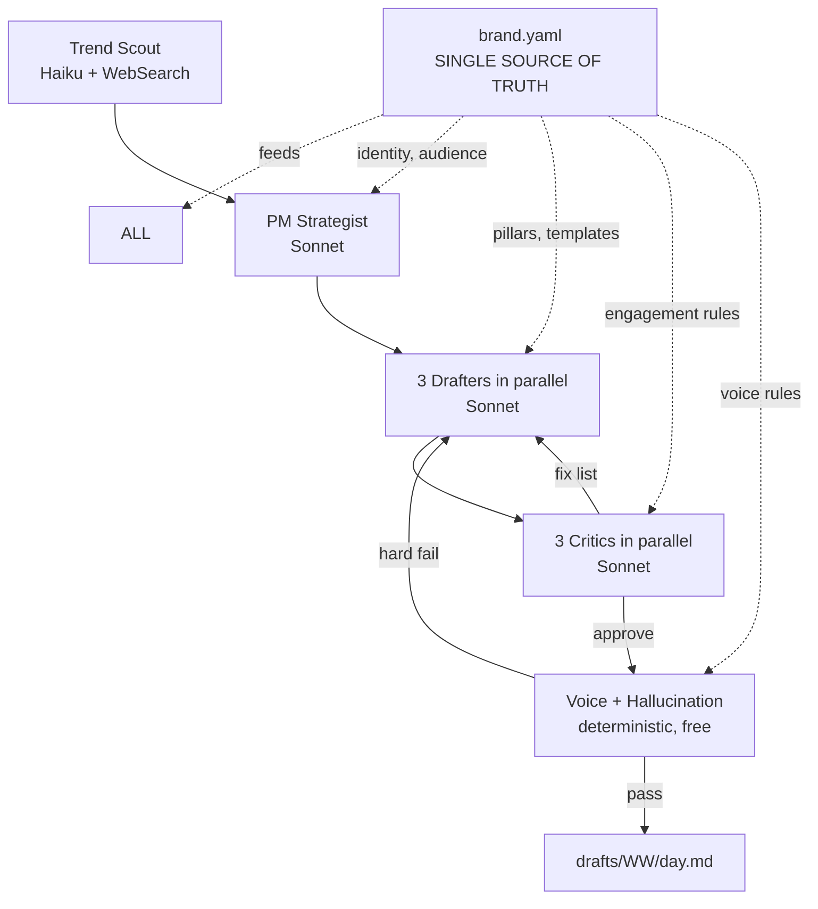

# PLAN.md — Multi-Agent Re-Architecture

> **Goal:** Replace the 6-stage script with a brand-config-driven multi-agent system that produces PM-targeted, engagement-aware LinkedIn drafts. Optimize for: speed (<90s/run), cost (<$0.20/run), and **single-file configurability** so changing strategy is a 1-minute edit, not a multi-hour code change.

---

## 1. Why the current system underdelivers

The existing 6-stage pipeline (scrape → cluster → score → angle → draft → polish) is correctness-focused, not quality-focused. It guarantees no hallucinations, no em-dashes, right cadence — but produces drafts that read as "any tech blogger." Three root causes:

1. **No live research.** Hard-coded RSS list. Doesn't know what AI PMs are actually posting about this week or what's getting engagement.
2. **No reader-specific reasoning.** Single LLM call writes a draft from a pillar template. No agent ever asks "would the target reader read past line 1?"
3. **Configuration is scattered.** Pillar configs in `pillars.yaml`, prompts in `prompts/pillars/*.md`, voice rules in `gate.ts`, retry logic in `pipeline.ts`. Changing positioning requires touching 4 files. Days, not minutes.

---

## 2. Three architectures considered

### A. Pure agentic (Research + Strategy + Critique)
Each step is an LLM agent reasoning about its task. Coordinator orchestrates.
- ✅ Solves quality. Adaptive. PM-specific.
- ❌ 5-10x cost ($0.50/run). Slow (5+ min). Configuration still scattered across N prompt files.

### B. Drafter + hallucination guardrail agents
Keep current drafter. Add LLM-based factuality/voice/PM-coding guards downstream.
- ✅ Cheap. Slight quality lift on safety.
- ❌ Doesn't solve the upstream strategic generic-ness. Guards check what's already wrong; they don't shape what gets written.

### C. Brand-config-driven hybrid (RECOMMENDED)
Single `brand.yaml` is the contract. All agents read from it. Cheap parallel agents do the upstream strategy work; deterministic gates do the downstream safety work.
- ✅ Solves quality (PM strategist + critic agents)
- ✅ Solves config sprawl (one file)
- ✅ Stays fast (parallel execution + Haiku for cheap reasoning)
- ✅ Stays cheap (deterministic gates do hallucination work for free)
- ✅ Hallucination control is HARDER, not softer (det. gate + critic = double safety)

---

## 3. Recommended architecture



**Agents:**

| Agent | Model | Job | Cost | Time |
|---|---|---|---|---|
| Trend Scout | Haiku 4.5 | WebSearch + RSS aggregation; returns "what's hot in AI PM this week" | $0.001 | 25s parallel |
| PM Strategist | Sonnet 4.6 | Picks 3 angles using brand.yaml positioning + scout output + 4-week dedupe | $0.01 | 10s |
| Drafter (×3 parallel) | Sonnet 4.6 | Writes per pillar template from brand.yaml | $0.01×3 | 15s |
| Critic (×3 parallel) | Sonnet 4.6 | Reads as the target audience (from the profile). Returns `{verdict: approve OR fix, reasons: []}` | $0.005×3 | 10s |
| Drafter retry (×N) | Sonnet 4.6 | Surgical fix per critic feedback. Max 2 loops. | $0.005×N | 15s |
| Deterministic Gates | none (regex) | Voice + per-claim hallucination check, FREE | $0 | <1s |

**Total: ~$0.10-0.15/run, ~80s wall time.** Inside the $0.50 / 3-min budget you set.

---

## 4. The "ONE place to change" — `brand.yaml`

This is the entire interface. To change strategy, you edit this file. Nothing else.

```yaml
# brand.yaml — SINGLE SOURCE OF TRUTH

identity:
  role: "Senior AI PM building 0→1 products at AI startups"
  goal: "Be known for clear, honest writing about building with LLMs"
  audience:
    primary: "AI PMs and eng leads at OpenAI, Anthropic, Google DeepMind"
    secondary: "AI investors, technical founders, applied ML engineers"
  positioning: "Strategic operator who ships, with strong technical judgment"

voice:
  must_have_in_every_post:
    - first_person_past_tense   # "I shipped", "the team learned"
    - one_concrete_number       # metric, $, %, count
    - one_named_product_or_person
  must_not_have:
    em_dashes: true
    en_dashes: true
    banned_phrases: [game-changer, thought leader, deep dive, delve, leverage,
      synergy, ecosystem, unpack, unlock, "Let that sink in", "Here's the thing"]
    banned_openers: ["I recently", "Excited to share", "Today I want to share"]
  rhythm:
    hook_max_words: 10
    paragraph_max_lines: 3
    target_words: [220, 280]
    target_chars: [1300, 1700]

cadence:
  mon:
    pillar: shipped
    template: |
      LINE 1: hook — contradiction or specific number, ≤10 words, no period
      LINES 2-3: 1-line context
      LINES 4-6: anecdote with specifics (product, metric, decision)
      LINES 7-9: tradeoff or lesson learned
      LAST LINE: closing claim or sharp question
    requires: [shipping_anecdote, named_product, metric_or_outcome]

  wed:
    pillar: framework
    template: |
      LINE 1: hook — name the framework or pattern, ≤10 words
      LINE 2: 1-line why it matters now
      LINES 3-N: numbered list, 3 items, 2-line each
      LAST LINE: application invitation
    requires: [named_framework, numbered_list, save_worthy_artifact]

  fri:
    pillar: critique
    template: |
      LINE 1: hook — name the launch + your contrarian angle
      LINE 2: 1-line on common interpretation
      LINES 3-5: "what others miss" with specifics
      LINES 6-8: your reframe with charity
      LAST LINE: invitation to debate
    requires: [specific_recent_launch, contrarian_take, named_company]

engagement:
  hook_patterns:
    - "I made a $X mistake. Here's what I learned."
    - "Stop doing X. Start doing Y."
    - "[Number] reasons [contrarian claim about thing]"
    - "[Specific PM/company] is wrong about X. Here's why."
    - "Last week I [specific action]. The unexpected result:"
  require_save_worthy: true   # framework name, table, checklist, or named pattern
  closing_question_optional: true   # strong claim is fine if no question
  white_space: aggressive            # 1-line paragraphs throughout

sources:
  rss: config/sources.yaml         # existing curated feeds
  web_search:
    enabled: true
    queries_per_run: 4
    queries:
      - "top AI PM LinkedIn posts last 7 days"
      - "OpenAI Anthropic product launch this week"
      - "AI product manager framework {today_year_month}"
      - "AI agent engineering and LLM evals {today_year_month}"
  voice_corpus:
    dir: data/voice-corpus
    samples_per_draft: 3
    refresh_handles: ["aakash_g", "shreyas", "lennysan"]   # fetch fresh weekly

agents:
  scout:      { model: claude-haiku-4-5,  max_tokens: 800 }
  strategist: { model: claude-sonnet-4-6, max_tokens: 1500 }
  drafter:    { model: claude-sonnet-4-6, max_tokens: 1500, parallel: true }
  critic:     { model: claude-sonnet-4-6, max_tokens: 600,  parallel: true }
  max_retry_loops: 2

budgets:
  cost_usd_per_run: 0.50
  wall_time_seconds: 180
  fallback_on_overrun: skip_with_summary

quality:
  publish_only_if_critic_approves: true
  publish_if_voice_gate_passes_even_if_critic_soft_rejects: false
  fail_open: false   # if all agents pass but gate fails, skip — never publish bad
```

**To change strategy:** edit `brand.yaml`. To change tone: edit `voice.must_have_in_every_post`. To add a 4th day: add a key under `cadence`. The agents recompose automatically.

---

## 5. Implementation plan (bite-sized, executable by Claude)

### Task 1: Schema + brand.yaml scaffold
- Create `src/lib/brand.ts` with Zod schema for the YAML above
- Create `brand.yaml` at repo root with the full config
- Add loader: `loadBrand(): Brand`
- Test: round-trip load + validate
- Commit: `feat(brand): add brand.yaml as single config source`

### Task 2: Trend Scout agent
- Create `src/agents/scout.ts`
- Use `WebSearch` tool through Anthropic with `web_search` server tool (or fall back to RSS if disabled)
- Aggregate: top 10 trending AI PM topics + top 10 product launches this week
- Returns: `ScoutOutput { trending_topics: [], recent_launches: [], engagement_signals: [] }`
- Test: mock fetch, assert structured output
- Commit: `feat(agents): trend scout with live web research`

### Task 3: PM Strategist agent
- Create `src/agents/strategist.ts`
- Inputs: `ScoutOutput`, `Brand`, recent angles (4-week dedupe), existing scrape clusters
- Single Sonnet call with structured output (Zod-validated)
- Returns: 3 angles, one per cadence day, each with: pillar, hook_idea, why_it_works, sources
- Test: snapshot test on fixture inputs
- Commit: `feat(agents): PM strategist picks angles from brand positioning`

### Task 4: Drafter agent (parallel ×3)
- Create `src/agents/drafter.ts`
- Input: one angle + `Brand` + cluster sources + voice samples
- Constructs prompt from `brand.cadence[day].template` + `brand.cadence[day].requires`
- Sonnet call with strengthened JSON-only system prompt + `extractJson` from existing draft.ts
- Run all 3 days in parallel via `Promise.all`
- Test: prompt assembly + JSON extraction on prose preamble
- Commit: `feat(agents): parallel drafter consuming brand templates`

### Task 5: PM Critic agent (parallel ×3)
- Create `src/agents/critic.ts`
- Input: draft + `Brand`
- Single Sonnet call. Reads draft "as the target audience" (from the profile).
- Returns: `{verdict: 'approve' | 'fix', reasons: string[], severity: 'block' | 'soft'}`
- Specific checks: PM signal present, audience-coded, hook strength, save-worthy artifact, engagement pattern match
- Run all 3 in parallel
- Test: snapshot tests on a generic blog-style draft (should fix) and a PM-coded draft (should approve)
- Commit: `feat(agents): critic reads target audience from profile`

### Task 6: Orchestrator with retry loop
- Create `src/agents/orchestrator.ts`
- Pipeline: scout → strategist → 3×(drafter → critic → [retry up to 2x]) → gates
- Track per-run cost; abort + write SKIPPED.md if budget exceeded
- Track wall time; abort if `wall_time_seconds` exceeded
- All retries surgical (preserves structure, fixes only listed issues)
- Test: end-to-end with mocked LLM calls; verify retry loop, parallelism, budget enforcement
- Commit: `feat(agents): orchestrator with parallel execution + budget guards`

### Task 7: Wire deterministic gates as final pass
- Reuse existing `runVoiceGate` + `runHallucinationGate` from `src/lib/gate.ts`
- Update gates to read banned_phrases from `brand.yaml` instead of hardcoded
- Final pass after critic approves; if det. gate fails, that's a system bug — log loud
- Test: gate config loaded from brand.yaml; banned word list adjustable
- Commit: `refactor(gates): drive from brand.yaml config`

### Task 8: New entry point
- Create `src/agentic-pipeline.ts` as the new main
- Update `package.json`: `"pipeline": "tsx src/agentic-pipeline.ts"` (replaces old)
- Old `src/pipeline.ts` renamed to `src/legacy-pipeline.ts`, kept as fallback only
- Test: full local run produces 3 drafts (using mocked LLM if no key in env)
- Commit: `feat(pipeline): wire agentic orchestrator as new entry point`

### Task 9: Update GitHub Actions workflow
- No change needed if entry point is same `pnpm pipeline` script
- Add cost-budget assertion in workflow: if `data/runs/<week>.json.total_cost_usd > 0.50`, comment on issue
- Commit: `ci: assert cost budget per run`

### Task 10: End-to-end live run
- Trigger pipeline.yml manually
- Verify: 3 drafts produced, each PM-coded, each passes voice + hall gates
- Cost in `data/runs/<week>.json` ≤ $0.20
- Wall time ≤ 90s
- Commit drafts auto-pushed to main

### Task 11: Tear down legacy pipeline
- After 2 successful agentic runs, delete `src/legacy-pipeline.ts`, old `prompts/pillars/*.md` (now in brand.yaml), `config/pillars.yaml` (now in brand.yaml)
- Keep `config/sources.yaml` (still used by scout for RSS)
- Update `README.md` + `ONEPAGER.md` with new architecture
- Commit: `chore: remove legacy 6-stage pipeline, brand.yaml is sole config`

---

## 6. Hallucination strategy — answered directly

You asked: research+strategy+critique vs hallucination guardrail agents vs current. **Answer: do all three at once, layered.**

- **Strategy layer (LLM agents):** Strategist + Critic prevent generic-ness. They're the upstream creative agents.
- **Hallucination layer (deterministic gates):** Per-claim type rules in `gate.ts` are the downstream safety net. They run LAST and are FREE.
- **Why both:** LLMs are bad at hard constraints (em-dashes leak even with "JSON only" prompts — we just spent 4 commits proving this). Regex doesn't leak. So use LLMs for what they're good at (creative judgment) and regex for what they're good at (binary rules).

**Hallucination guardrail agents alone (option B) lose** because they don't have the upstream strategic context. By the time a guardrail agent sees the draft, the angle is already wrong.

---

## 7. Speed strategy — answered directly

You asked: super, super fast. Three levers:

1. **Parallelize aggressively.** All 3 drafts in parallel (3x speedup over sequential). All 3 critics in parallel. WebSearch queries in parallel.
2. **Use Haiku for non-creative work.** Scout doesn't need Sonnet. Saves $0.05 + 10s.
3. **Surgical retries.** Cap at 2 loops. Best-attempt selection (already implemented in polish.ts) carries over.

Target: <90s wall time, <$0.20 cost.

---

## 8. "One place to change" — answered directly

You asked: changes in one place, not hours/days. Three design decisions enforce this:

1. **`brand.yaml` is the only config.** Pillar templates, voice rules, agent models, budgets, queries — all there. Agents are dumb consumers.
2. **Templates are inline strings, not separate files.** No more `prompts/pillars/*.md` to keep in sync. Edit the template right next to the requires list.
3. **Agents share a base class** (`src/agents/_base.ts`) with `client`, `brand`, `cost_tracker`. Adding a new agent = one file, ~50 lines. Removing = delete one file.

Test of the design: "Switch from AI PM to AI infra PM focus." With current system: edit pillar prompts (3 files), update gate banned words, change voice samples. ~2 hours. With new system: change `identity.role` in brand.yaml. 30 seconds.

---

## 9. What I will NOT do

- Build a UI / dashboard (over-engineering)
- Add more pillars beyond the 3 (Mon/Wed/Fri locked by cadence)
- Scrape LinkedIn directly (TOS, fragility)
- Ship before all 48 tests pass + new tests for agents
- Touch your existing posted/ directory or workflow trigger schedule

---

## 10. Execution

Per `superpowers:subagent-driven-development`:
- I will dispatch a fresh implementer subagent per task
- Two-stage review (spec compliance → code quality) per task
- Commit per task to main
- Final code review across all tasks before declaring done
- Estimated total: ~3-4 hours of subagent work, 0 minutes of your time

**You decide:** approve this plan as written, or redirect on specific points. After approval, I execute end-to-end without further input.

---

## 11. Decision request

Reply with one of:
- ✅ **"go"** — I start Task 1 immediately, work through all 11 tasks, ping you when done
- 🔧 **"change X"** — I revise the plan first
- ❌ **"different approach"** — I rebrainstorm
