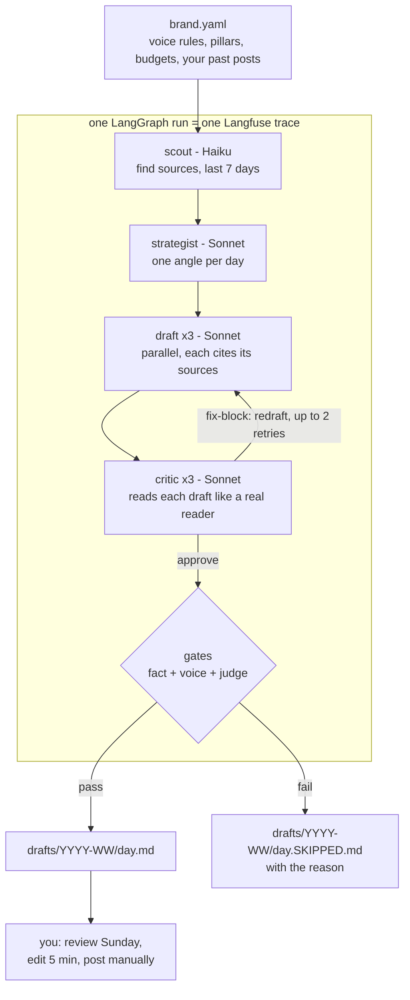

# LinkedIn Content Engine

**An open-source AI agent that writes three LinkedIn posts a week in your voice.**

You give it a profile that describes how you write and what you care about. Every
week the agent reads what is new in your field, drafts three posts in your style,
and runs each one through quality gates so nothing fake or generic gets through.
It writes the drafts. You read them, edit for five minutes, and post. The agent
never posts for you.

It writes drafts. It refuses to write bad ones. It shows its work.

## What it does

- **Finds what is worth posting about.** Pulls real sources from the last seven
  days in the topics you list (launches, announcements, trends).
- **Writes in your voice, not a generic one.** It reads your own past posts as
  voice samples and mirrors your rhythm, not LinkedIn boilerplate.
- **Checks itself before it ships.** Three gates run on every draft: a fact gate
  (every claim must cite a source the agent actually read), a voice gate (banned
  phrases, dashes, broken rhythm), and an LLM judge scored against your best
  posts. A draft that fails is held back with the reason, not published.
- **Shows its work.** Every model call is a Langfuse span, so a whole run is one
  readable trace you can open and inspect.
- **Costs about $2 a month** and runs on free tiers plus a GitHub Actions cron.
  No server.

## How it works (technical)

The agent is a [LangGraph](https://github.com/langchain-ai/langgraphjs)
`StateGraph`. Each node is small and single-purpose: it reads the shared
`brand.yaml`, does one job, writes its result onto graph state, and emits a
Langfuse span. The graph wiring lives in
[`packages/engine/src/graph.ts`](./packages/engine/src/graph.ts).

| Node | Model | Job |
|---|---|---|
| **scout** | Haiku | Find sources from the last 7 days (web search, RSS fallback). |
| **strategist** | Sonnet | Pick one angle per day, pinned to that day's pillar in `brand.yaml`. |
| **draft** | Sonnet x3 | Write three drafts in parallel. Each emits `claims[]` with source URLs. |
| **critic** | Sonnet x3 | Read each draft like a target reader. Returns approve / fix-soft / fix-block. |
| **gate** | none | Deterministic. Fact gate, voice gate, then the LLM judge. Decides publish or skip. |

Two decision points make the "when not to publish" logic explicit:

- **The retry loop.** A conditional edge from `critic` back to `draft`. If any
  day comes back `fix-block` and there is retry budget left
  (`max_retry_loops`, default 2), that day is redrafted. Otherwise the run moves
  on to the gates.
- **The publish/skip fork.** The `gate` node runs the fact gate, voice gate, and
  judge. A draft that passes all three is written to `drafts/YYYY-WW/{day}.md`.
  One that fails is written to `{day}.SKIPPED.md` with the reason.

Other technical notes:

- **`brand.yaml` is the single source of truth.** Voice rules, banned phrases,
  rhythm bands, per-day pillars, agent models, budgets, and gate modes all live
  there. To change strategy you edit that file, not code. The engine never
  hardcodes a voice; the profile path comes from `--profile`.
- **Gates are deterministic.** They never call an LLM and never throw on a bad
  draft. They return `{ pass, ... }` and the caller decides.
- **Cost is tracked on graph state.** The run aborts if it crosses the profile's
  `budgets.cost_usd_per_run` cap.
- **Every LLM call goes through `observe()`** so it lands in a Langfuse span with
  token and cost metadata. A run is one trace, one span per node.

See [ARCHITECTURE.md](./ARCHITECTURE.md) for the full map.

## Architecture



## User journey

1. **Set up once.** Fork the repo, add your Anthropic API key, and write your
   `brand.yaml`: your topics, your voice rules, your per-day pillars. Drop a few
   of your own past posts into the profile so the agent learns your tone.
2. **It runs on a schedule.** A GitHub Actions cron runs the agent for you. No
   server to keep alive. (Run it by hand any time with `pnpm pipeline`.)
3. **The agent does the loop.** scout to strategist to draft to critic to gates.
   Bad drafts get retried, then held back if they still fail.
4. **You get three drafts.** Published drafts land in `drafts/YYYY-WW/`. Skipped
   days sit next to them with the reason they were held back.
5. **You review on Sunday.** Read the three, edit for about five minutes, post
   the ones you like. Verify any numbers or facts first.
6. **You post.** Manually, always. The agent never touches LinkedIn.

## Quick start (about 30 minutes)

```bash
pnpm install
cp .env.example .env          # add your Anthropic key (Langfuse optional)
pnpm pipeline --profile examples/sai-voice --dry-run
```

A run prints `week ...: N/3 published, $cost` and writes to `drafts/`.

Make your own voice:

```bash
cp -r examples/_template examples/my-voice
# edit examples/my-voice/brand.yaml
pnpm pipeline --profile examples/my-voice
```

## Demo

- Demo profile: [`examples/sai-voice`](./examples/sai-voice)
- A recent run's drafts: [`drafts/`](./drafts) (the cron archives fresh drafts to the [`weekly-drafts`](https://github.com/Imasaikiran/linkedin-engine/tree/weekly-drafts/drafts) branch, keeping `main` protected)
- Public Langfuse trace: [a real run, span per node](https://cloud.langfuse.com/trace/1e5a5622cf85438f2b45e7f50bf983de)

## Design docs

- [Product requirements](./docs/v2/PRD.md)
- [Technical design](./docs/v2/DESIGN.md)
- [Architecture](./ARCHITECTURE.md)
- [How to contribute](./CONTRIBUTING.md)

## Status

v2 is live. The LangGraph engine, Langfuse tracing, Supabase run stats, and the
read-only dashboard all ship. Three gates run in blocking mode: a deterministic
fact gate (every claim must cite a scouted source), a deterministic voice gate
(rhythm and banned-phrase rules), and an LLM judge scored against a golden corpus.
See [DESIGN.md](./docs/v2/DESIGN.md) section 14 and
[docs/v2/judge-calibration.md](./docs/v2/judge-calibration.md) for how the gates
were calibrated.

MIT licensed. The engine never posts to LinkedIn. A human always posts.
